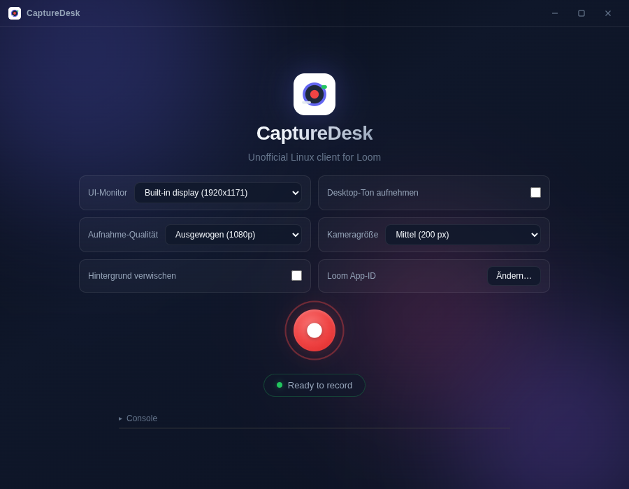

# CaptureDesk

**An unofficial Loom recorder for Linux.** Loom has no desktop app for Linux, and recording in the browser gives you no camera bubble that floats over other windows, no drawing on screen and no global shortcuts. CaptureDesk wraps the Loom Record SDK in an Electron app that adds them. The videos are uploaded to Loom as usual.



> [!IMPORTANT]
> CaptureDesk is an independent project. It is not affiliated with, endorsed by, or supported by Loom, Inc. or Atlassian. "Loom" is a trademark of its respective owner.

## Features

- **Screen recording through Loom:** videos are uploaded to Loom as usual
- **Camera bubble** that floats above all windows: drag to move it, scroll to resize it, double-click to reset it
- **Background blur** for the camera, computed locally with MediaPipe (nothing is uploaded, works offline)
- **Drawing overlay:** pen, highlighter, arrow, rectangle and eraser in five colors, with undo (`Ctrl+Z`) and clear
- **Floating controls** with timer, pause, stop and the drawing tools, while the main window stays out of the video
- **Desktop audio:** optionally record system sound along with your microphone
- **Capture quality:** passthrough, 1080p or native resolution
- **Multi-monitor:** choose which monitor the camera bubble and controls appear on

### Keyboard shortcuts

These work globally while a recording is running:

| Shortcut | Action |
| --- | --- |
| `Ctrl+Shift+S` | Stop recording |
| `Ctrl+Shift+P` | Pause or resume |
| `Ctrl+Shift+D` | Toggle the drawing overlay |

## Installation

CaptureDesk runs on Linux desktops with X11 or Wayland and is developed and tested on Ubuntu with GNOME. Building it requires [Node.js](https://nodejs.org/) 22 and npm.

> [!CAUTION]
> Builds contain the proprietary Loom SDK, and the [Loom SDK Beta Agreement](http://cdn.loom.com/assets/marketing/sdk-beta-agreement.pdf) does not allow redistributing it. That is why there are no prebuilt downloads. Build CaptureDesk yourself, for your own use, and do not publish the packages (for example as GitHub releases).

### Debian and Ubuntu

```bash
git clone https://github.com/PascalNehlsen/CaptureDesk.git
cd CaptureDesk
npm install
npm run dist:deb
sudo apt install ./release/capturedesk_1.0.0_amd64.deb
```

CaptureDesk is installed to `/opt/CaptureDesk` and shows up in the application menu. Remove it with `sudo apt remove capturedesk`.

### Other distributions

`npm run dist` builds an AppImage in `release/` instead:

```bash
chmod +x release/CaptureDesk-*.AppImage
./release/CaptureDesk-*.AppImage
```

## Getting started

1. **Create a Loom developer app.** Sign up in the [Loom Developer Portal](https://www.loom.com/developer-portal) and create an app, which is free. CaptureDesk only needs the app's public **app ID**, not its private key.
2. **Enter the app ID.** On first start, CaptureDesk asks for it and saves it to `~/.config/CaptureDesk/.env`. You can change it later under **Loom App-ID** in the settings.
3. **Record.** Click the record button, choose what to share, and sign in to Loom if asked. Once the countdown starts, the main window gets out of the way and the camera bubble and controls take over.

> [!NOTE]
> A paid Loom plan is not required. Without signing in, you can record as a guest: 5 recordings of up to 5 minutes each. The free Starter plan keeps up to 25 videos, with a 5-minute limit per recording. Paid plans lift these limits.

## Configuration

CaptureDesk reads its settings from `~/.config/CaptureDesk/.env` (or `$XDG_CONFIG_HOME/CaptureDesk/.env`). The setup window writes `app_id` there for you.

| Variable | Default | Description |
| --- | --- | --- |
| `app_id` | none | Public app ID of your Loom developer app |
| `PORT` | `8080` | Port of the local server that serves the app's pages (1–65535) |
| `loom_environment` | `production` | Loom environment the SDK connects to |

Settings changed in the main window (monitor, quality, camera size, blur, desktop audio) are saved automatically.

## Development

```bash
npm install
npm run electron
```

`npm run electron` bundles the Loom SDK into `src/public/` and starts the app from the checkout.

> [!TIP]
> Instead of using the setup window, you can copy `example.env` to `.env` in the project directory and fill in `app_id`. If `~/.config/CaptureDesk/.env` exists, it takes precedence.

| Script | What it does |
| --- | --- |
| `npm run electron` | Start the app from the checkout |
| `npm run electron:no-sandbox` | The same, without the Chromium sandbox |
| `npm run desktop:install` | Add a launcher for the checkout to the application menu |
| `npm run pack` | Build an unpacked app in `release/linux-unpacked/` |
| `npm run dist` | Build an AppImage in `release/` |
| `npm run dist:deb` | Build a `.deb` package in `release/` |
| `npm run vendor:sync` | Re-bundle the Loom SDK and the MediaPipe runtime from `node_modules/` |

### Project layout

- `electron-main.js` is the main process: windows, shortcuts, settings, and the switch between the main window and the recording UI.
- `src/server/` is a small Express server on `localhost` that serves the pages and the app ID. The camera bubble needs an HTTP origin because MediaPipe's WebAssembly runtime does not load from `file://`.
- `src/views/` and `src/public/` hold the pages: main window, camera bubble, controls, drawing overlay and setup window.
- `scripts/` holds the launchers and build helpers.

## Troubleshooting

**The AppImage does not start.**
Install FUSE support: `sudo apt install libfuse2t64` on Ubuntu 24.04 and later, `libfuse2` on older releases.

**Does CaptureDesk work on Wayland?**
Yes, through XWayland. CaptureDesk always starts with `--ozone-platform=x11`, because native Wayland does not let apps position their own windows, and the camera bubble and controls depend on that.

**Recording does not start, or the Loom sign-in does not appear.**
Check the app ID under **Loom App-ID**. **Console** at the bottom of the main window shows the SDK's log messages.

## License

The CaptureDesk source code is released under the [MIT License](LICENSE).

> [!NOTE]
> The MIT License does not cover third-party components. The Loom Record SDK is proprietary and not part of this repository; `npm install` downloads it from npm. See [`THIRD_PARTY_NOTICES.md`](THIRD_PARTY_NOTICES.md) for details.
